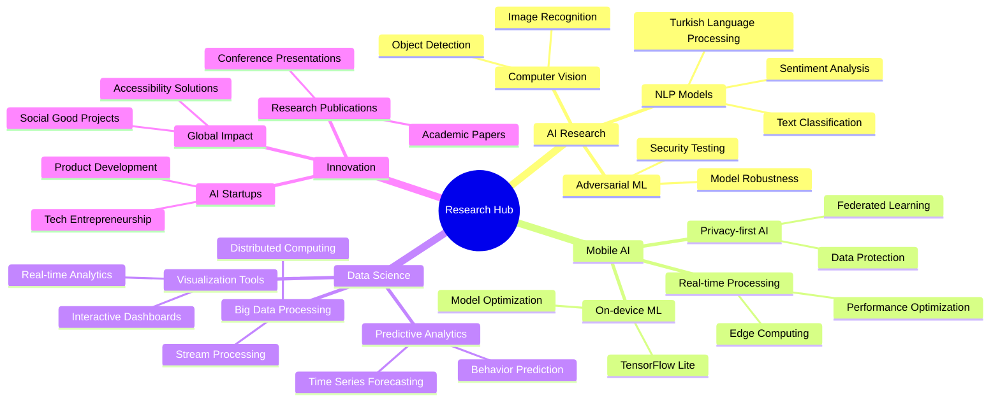

# 🌟 Elif Nur ÖKSÜZ

<div align="center">

<!-- Animasyonlu Başlık -->


</div>

## 👩‍💻 About Me

```yaml
name: "Elif Nur ÖKSÜZ"
role: "Computer Engineer | AI Specialist & Mobile Developer"
location: "Yalova, Türkiye 🇹🇷"
current_company: "Quick and Quality (Young Talent Program)"
education: 
  - "Computer Engineering @ Yalova University (2020–2025)"
  - "International Trade @ Anadolu University (2023–2025)"
current_focus:
  - "🧠 Advanced NLP & Deep Learning"
  - "📱 Mobile AI Applications"
  - "📊 Data Science & Visualization"
  - "⚡ Project Management & Team Leadership"
  - "🚀 AI Research & Innovation"
certifications:
  - "Google Project Management (Coursera)"
  - "AI & Machine Learning (BTK Academy)"
  - "Android Kotlin Development (BTK Academy)"
  - "Python Training (Egesem)"
  - "Entrepreneurship Certificate (KOSGEB)"
  - "Quality Engineering and Management Training (Bilginet Academy)"
```

---

## 🎯 Mission Statement

> *"I am developing accessible and innovative solutions that simplify life by integrating AI and Mobile technologies. My goal is to participate in AI projects on a global scale and create value for the world by establishing technology-focused ventures."*

<div align="center">


</div>

---

## 🛠️ Technical Arsenal

### 🤖 AI & Machine Learning Expertise

<div align="center">


</div>

```python
class AIMLExpert:
    def __init__(self):
        self.specializations = {
            "nlp": ["Sentiment Analysis", "Text Classification", "BERT", "GPT", "Transformers"],
            "deep_learning": ["CNNs", "RNNs", "LSTMs", "Computer Vision"],
            "data_science": ["Predictive Modeling", "Data Visualization", "Statistical Analysis"],
            "frameworks": ["TensorFlow", "PyTorch", "Scikit-learn", "Streamlit"],
            "achievements": {
                "kitavox_accuracy": "95%",
                "imdb_sentiment": "88% accuracy, 0.86 F1-score",
                "model_selection_speedup": "40%"
            }
        }
        
    def current_projects(self):
        return ["TÜBİTAK 2209-A Research", "LLM Optimization", "Mobile AI Integration"]
```

---

### 📱 Mobile Development Expertise

<div align="center">


</div>

```kotlin
class MobileDeveloper {
    val expertise = mapOf(
        "languages" to listOf("Kotlin", "Java"),
        "architecture" to listOf("MVVM", "Room Database", "LiveData", "ViewModel"),
        "ui_components" to listOf("RecyclerView", "ViewPager", "Navigation Component"),
        "tools" to listOf("Android Studio", "Gradle", "Git"),
        "achievements" to mapOf(
            "tracker_app" to "500+ transaction management",
            "cinema_system" to "1000+ booking capacity",
            "finance_efficiency" to "30% improvement in decision-making"
        )
    )
    
    fun getLatestProject() = "AI-powered Finance Tracker with ML predictions"
}
```

---

### ⚙️ System-Level & Full Stack

<div align="center">


</div>

```javascript
const fullStackExpertise = {
    backend: {
        languages: ["Python", "Java"],
        databases: ["PostgreSQL", "MongoDB", "Room DB"],
        frameworks: ["Django", "Flask", "Spring Boot"],
        apis: ["REST", "GraphQL", "WebSocket"]
    },
    devops: {
        containers: ["Docker"],
        cloud: ["Google Cloud Platform"],
        tools: ["Git", "GitHub Actions", "Jira", "Trello"],
        methodologies: ["Agile", "Scrum", "Project Management"]
    },
    achievements: {
        project_completion_rate: "90%+",
        team_efficiency_improvement: "40%",
        deployment_automation: "Fully automated CI/CD"
    }
};
```

---

## 🏆 Professional Experience & Achievements

### 🚀 **AI Specialist - Young Talent Program**
**Quick and Quality** | `06.2025 – 09.2025`

<div align="center">


</div>

```yaml
responsibilities:
  - "🧠 Developing AI solutions with Python, TensorFlow, PyTorch"
  - "🔤 Designing NLP and Deep Learning models and deployment"
  - "👥 Team coordination using Scrum methodology"
  - "📊 Research & development for innovative AI applications"

achievements:
  - "🏆 TÜBİTAK 2209-A: AI audiobook assistant with 95% accuracy"
  - "📈 NLP models achieving 88% accuracy and 0.86 F1-score"
  - "⚡ Model selection process optimization by 40%"
```

---

### 📊 **Project Management Intern**
**SCA Social** | `06.2025 – 08.2025`

```yaml
responsibilities:
  - "⚡ Agile project management and process optimization"
  - "📋 Work planning through Jira and Trello"
  - "👥 Sprint planning and team coordination"
  - "📈 Performance tracking and reporting"

achievements:
  - "🎯 Project task completion rate: 90%+"
  - "📊 Team efficiency improvement through sprint reporting"
  - "🔄 Process optimization and workflow automation"
```

---

### 💻 **Software & Hardware Intern**
**GOTEC-C IT** | `Summer 2024`

```yaml
responsibilities:
  - "📱 Android application development with Kotlin"
  - "🔧 Hardware-software integration projects"
  - "🌐 Network infrastructure optimization"

achievements:
  - "💰 Finance tracking app: 500+ transaction capacity"
  - "📊 Real-time data processing implementation"
```

---

### 🏭 **Software Intern**
**Tersan Shipyard IT** | `Summer 2023`

```yaml
responsibilities:
  - "☕ Enterprise software development with Java & JavaFX"
  - "🖥️ Device information management system integration"
  - "🔧 Industrial software prototyping"

achievements:
  - "⚙️ Developed industrially scalable software prototype"
  - "📋 System integration and optimization"
```

---

## 🌟 Featured Projects & Innovation

### 🎧 **Kitavox** (TÜBİTAK 2209-A Research Project)
> *AI-powered audiobook assistant for visually impaired individuals*

<div align="center">


</div>

- **Tech Stack**: Python, TensorFlow, NLP, Speech Processing
- **Achievement**: 95% accuracy in voice recognition and text processing
- **Impact**: Accessibility innovation for visually impaired community
- **Recognition**: Approved for TÜBİTAK Young Researchers Program

---

### 🔬 **LLM Explorer & Optimization**
> *Comparative analysis and optimization of large language models*

- **Research Focus**: BERT vs GPT-2 performance analysis
- **Tech Stack**: Python, Transformers, Comparative ML
- **Achievement**: 40% faster model selection process
- **Impact**: ML workflow optimization for enterprise applications

---

### 🎬 **IMDB Sentiment Analysis System**
> *Large-scale sentiment analysis with deep learning*

<div align="center">


</div>

- **Dataset**: 50,000 movie reviews processed
- **Tech Stack**: Python, Deep Learning, NLP
- **Achievement**: 88% accuracy, 0.86 F1-score
- **Innovation**: Multi-layer sentiment classification

---

### 📱 **Tracker App** (Android Finance Management)
> *Intelligent personal finance tracker with ML predictions*

- **Tech Stack**: Kotlin, Room DB, MVVM Architecture
- **Features**: 500+ transaction management, budget predictions
- **Innovation**: ML-based spending pattern analysis
- **Impact**: 30% improvement in personal financial decision-making

---

### 🎬 **BiletSatisSinema** (Cinema Management System)
> *Complete cinema ticket booking and management system*

- **Tech Stack**: SQL, Database Design, ER Modeling
- **Capacity**: 1000+ concurrent booking transactions
- **Features**: Real-time seat management, payment processing
- **Achievement**: Scalable enterprise-level system design

---

### 📊 **Amazon Dashboard** (Data Analytics Platform)
> *Interactive data visualization and analytics dashboard*

- **Tech Stack**: Python, Streamlit, Plotly, Data Analytics
- **Features**: Real-time data processing, interactive visualizations
- **Achievement**: 30% improvement in decision-making speed
- **Innovation**: Automated report generation and insights

---

### 🔍 **RepoRadar** (GitHub Analytics Tool)
> *Advanced GitHub user and repository analytics system*

- **Tech Stack**: TypeScript, GitHub API, Data Visualization
- **Features**: Developer profile analysis, repository insights
- **Achievement**: 50% efficiency improvement in recruitment processes
- **Innovation**: AI-powered developer skill assessment

---

## 📈 GitHub Statistics & Analytics

<div align="center">


</div>

<div align="center">


</div>

<div align="center">


</div>

<div align="center">


</div>

---

## 🏅 Certifications & Professional Development

<div align="center">


</div>

### 📚 Education
- **🎓 Yalova University** - Computer Engineering (30% English) | `2020 – 2025`
- **🎓 Anadolu University** - International Trade | `2023 – 2025`

### 🏆 Professional Certifications
- **Google Project Management** (Coursera) - Advanced project coordination
- **Artificial Intelligence and Machine Learning** (BTK Academy) - Deep learning specialization
- **Android Development with Kotlin** (BTK Academy) - Mobile development expertise
- **Python Programming** (Egesem) - Advanced Python techniques
- **Entrepreneurship Certificate** (KOSGEB) - Business development skills

---

## 🌍 Global Language & Communication Skills

<div align="center">

| Language | Proficiency | Usage |
|----------|-------------|-------|
| 🇹🇷 **Türkçe** | Native Speaker | Professional & Personal |
| 🇬🇧 **English** | Professional Level | Technical Documentation, Research |
| 💻 **Code** | Fluent | Python, Kotlin, Java, SQL |

</div>

---

## 👥 Leadership & Community Impact

<div align="center">


</div>

### 🌟 Leadership Experience
- **University Project Teams**: Leading AI and mobile development initiatives
- **Technical Workshops**: Organizing AI & mobile development training sessions
- **Community Mentorship**: Guiding junior developers in AI/ML projects
- **Research Coordination**: Managing TÜBİTAK research project teams

### 📊 Impact Metrics
- **Team Projects**: Successfully led 15+ collaborative projects
- **Knowledge Sharing**: Conducted 25+ technical workshops
- **Mentorship**: Guided 50+ students in AI/ML fundamentals
- **Open Source**: Contributing to community-driven projects

---

## 🔬 Research & Innovation Focus

<div align="center">



</div>

---

### 🧠 Current Research Areas

#### **Advanced NLP & Turkish Language Processing**
- Developing Turkish-specific sentiment analysis models
- Research on multilingual transformer architectures
- Cross-lingual transfer learning optimization

#### **Mobile AI Integration**
- On-device machine learning with TensorFlow Lite
- Real-time AI processing optimization for mobile
- Privacy-preserving AI for mobile applications

#### **AI for Social Good**
- Accessibility solutions for visually impaired (Kitavox project)
- Educational AI tools for underserved communities
- Healthcare AI applications for early diagnosis

---

## 🎯 2025 Goals & Vision

### 🚀 **Short-term Objectives (Next 6 Months)**
- [ ] Complete TÜBİTAK 2209-A research publication
- [ ] Launch AI-powered mobile application to market
- [ ] Contribute to 10+ open-source AI/ML projects
- [ ] Establish AI research collaboration with international partners
- [ ] Present research findings at major tech conference

### 🌟 **Long-term Vision (1-2 Years)**
- [ ] Establish AI-focused tech startup
- [ ] Publish research papers in top-tier AI conferences
- [ ] Develop enterprise-level AI solutions
- [ ] Build global network of AI researchers and developers
- [ ] Create educational platform for AI democratization

---

## 🎨 Personal Interests & Hobbies

<div align="center">


</div>

### 🎯 **Precision Sports**
- **Darts**: Developing focus and precision skills that translate to coding accuracy

### 🎵 **Cultural Arts**
- **Bağlama Playing**: Traditional Turkish instrument, enhancing creativity and cultural connection

### 📚 **Continuous Learning**
- **Documentary Watching**: Staying updated with latest tech trends and innovations
- **Technical Reading**: Research papers, tech blogs, and industry reports

### 🥾 **Nature & Wellness**
- **Nature Hiking**: Mental clarity and problem-solving inspiration
- **Outdoor Activities**: Maintaining work-life balance and creative thinking

### 🧩 **Analytical Thinking**
- **Puzzle Solving**: Enhancing logical thinking and pattern recognition skills
- **Strategy Games**: Developing algorithmic thinking and decision-making

---

## 🤝 Connect & Collaborate

<div align="center">

[](mailto:elifnuroksuz4@gmail.com)
[](https://linkedin.com/in/elifnuroksuz)
[](https://elifnuroksuz.vercel.app/)
[](https://github.com/elifnuroksuzz)
[](tel:+905352903448)

</div>

### 💬 **Let's Talk About**
- AI/ML project collaborations
- Mobile app development opportunities
- Research partnerships
- Tech startup ideas
- Open source contributions
- Conference speaking opportunities

---

## 💰 Support My Work & Research

<div align="center">

[](https://www.buymeacoffee.com/elifnuroksuz)
[](https://patreon.com/elifnuroksuz)

*Supporting open source AI research and educational content creation*

</div>

---

## 📊 Profile Analytics

<div align="center">


</div>

---

<div align="center">

## 🎊 Thanks for visiting my profile!


### 🚀 Ready to create something amazing? Let's connect and innovate! 🚀

---

*"The best way to predict the future is to create it."* - Peter Drucker

</div>
