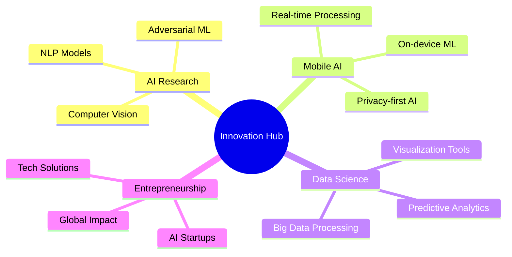

# 🌟 Elif Nur ÖKSÜZ

<div align="center">

<!-- Animasyonlu Başlık -->


</div>

---

<table>
<tr>
<td width="60%" valign="top">

## 👨‍💻 About Me

```yaml
name: "Elif Nur ÖKSÜZ"
role: "AI Specialist & Mobile Developer"
location: "Yalova, Türkiye 🇹🇷"
current_company: "Quick and Quality (Young Talent Program)"
education: 
  - "Computer Engineering @ Yalova University (2020–2025)"
  - "International Trade @ Anadolu University (2023–2025)"
specializations:
  - "🧠 Artificial Intelligence & Machine Learning"
  - "📱 Android Development (Kotlin/Java)"
  - "🔤 Natural Language Processing"
  - "📊 Data Science & Analytics"
  - "⚡ Project Management (Agile/Scrum)"
```

### 🎯 Mission Statement
> *"AI & Mobile teknolojilerini birleştirerek hayatı kolaylaştıran, erişilebilir ve yenilikçi çözümler geliştiriyorum. Hedefim global ölçekte AI projelerinde yer almak ve teknoloji odaklı girişimler kurmak."*

---

## 🛠️ Technical Arsenal

### 🤖 AI & Machine Learning
<div align="center">


</div>

```python
class AISpecialist:
    def __init__(self):
        self.expertise = {
            "nlp": ["Sentiment Analysis", "Text Classification", "BERT", "GPT"],
            "deep_learning": ["CNNs", "RNNs", "LSTMs", "Transformers"],
            "data_science": ["Predictive Modeling", "Data Visualization"],
            "achievements": {
                "kitavox_accuracy": "95%",
                "imdb_sentiment": "88% accuracy, 0.86 F1-score",
                "model_selection_speedup": "40%"
            }
        }
```

### 📱 Mobile Development
<div align="center">


</div>

```kotlin
class MobileDeveloper {
    val skills = mapOf(
        "languages" to listOf("Kotlin", "Java"),
        "architecture" to listOf("MVVM", "Room DB", "LiveData"),
        "ui_components" to listOf("RecyclerView", "ViewPager", "Navigation"),
        "achievements" to mapOf(
            "tracker_app" to "500+ transactions",
            "cinema_system" to "1000+ capacity",
            "finance_efficiency" to "Improved by 30%"
        )
    )
}
```

### 🔧 Tools & Frameworks
<div align="center">


</div>

---

## 🏆 Professional Experience

### 🚀 Current Role: AI Specialist
**Quick and Quality - Young Talent Program** `06.2025 – 09.2025`
- 🧠 Developing AI solutions with Python, TensorFlow, PyTorch
- 🔤 Designing NLP and Deep Learning models
- 👥 Team coordination using Scrum methodology
- **Achievement**: 95% accuracy in TÜBİTAK 2209-A project

### 📊 Project Management Intern
**SCA Social** `06.2025 – 08.2025`
- ⚡ Agile project management, process optimization
- 📈 Work planning through Jira and Trello
- **Achievement**: 90%+ task completion rate

### 💻 Previous Roles
- **Software & Hardware Intern** - GOTEC-C IT (Summer 2024)
- **Software Intern** - Tersan Shipyard IT (Summer 2023)

---

## 🌟 Featured Projects

### 🎧 **Kitavox** (TÜBİTAK 2209-A)
> AI-based audiobook assistant for visually impaired
- **Tech Stack**: Python, TensorFlow, NLP
- **Achievement**: 95% accuracy rate
- **Impact**: Accessibility innovation

### 📊 **LLM Explorer**
> BERT vs GPT-2 comparative analysis
- **Tech Stack**: Python, Transformers, Comparative ML
- **Achievement**: 40% faster model selection
- **Impact**: ML workflow optimization

### 🎬 **IMDB Sentiment Analysis**
> Large-scale sentiment analysis system
- **Tech Stack**: Python, NLP, Deep Learning
- **Dataset**: 50,000 movie reviews
- **Achievement**: 88% accuracy, 0.86 F1-score

### 📱 **Tracker App** (Android)
> Personal finance management application
- **Tech Stack**: Kotlin, Room DB, MVVM
- **Capacity**: 500+ transaction management
- **Features**: Real-time analytics, budget tracking

### 🎬 **BiletSatisSinema**
> Cinema ticket booking system
- **Tech Stack**: SQL, Database Design
- **Capacity**: 1000+ transaction handling
- **Features**: ER diagram implementation

---

## 📈 GitHub Analytics

<div align="center">


</div>

<div align="center">


</div>

<div align="center">


</div>

---

## 🏅 Certifications & Achievements

<div align="center">


</div>

---

## 🌍 Skills Matrix

<div align="center">

| Category | Technologies | Proficiency |
|----------|-------------|-------------|
| **AI/ML** | Python, TensorFlow, PyTorch, Scikit-learn | ⭐⭐⭐⭐⭐ |
| **Mobile** | Kotlin, Java, Android Studio | ⭐⭐⭐⭐⭐ |
| **Data Science** | Pandas, NumPy, Matplotlib, Streamlit | ⭐⭐⭐⭐⭐ |
| **Database** | SQL, MongoDB, Room DB | ⭐⭐⭐⭐⭐ |
| **Project Mgmt** | Agile, Scrum, Jira, Trello | ⭐⭐⭐⭐⭐ |
| **Cloud** | Google Cloud, Docker | ⭐⭐⭐⭐ |

</div>

</td>
<td width="40%" valign="top">

## 🎥 About Me Video

<div align="center">

[](https://github.com/elifnuroksuzz/elifnuroksuzz/blob/main/assets/video.mp4)

*"Merhaba! Ben Elif Nur Öksüz. AI ve mobil geliştirme alanındaki yolculuğumu ve projelerimi bu videoda anlatıyorum."*

</div>

---

## 🔥 Current Focus

```javascript
const currentLearning = {
    aiResearch: "Advanced NLP & Transformers",
    mobileAI: "On-device ML with TensorFlow Lite",
    cloudTech: "AI Model Deployment at Scale",
    leadership: "Tech Team Management",
    goal: "Global AI Projects & Tech Entrepreneurship"
}
```

---

## 📊 Coding Stats

<div align="center">


</div>

---

## 🌟 Recent Achievements

- 🏆 **TÜBİTAK 2209-A**: AI Audiobook Assistant (95% accuracy)
- 📱 **Android App**: Finance Tracker (500+ transactions)
- 🧠 **NLP Model**: IMDB Sentiment Analysis (88% accuracy)
- 📈 **Efficiency**: Model selection process 40% faster
- 👥 **Leadership**: 90%+ project completion rate

---

## 🎯 2025 Goals

- [ ] Publish AI research paper
- [ ] Launch mobile AI application
- [ ] Contribute to 5 open-source projects
- [ ] Speak at tech conference
- [ ] Establish AI startup prototype

---

## 💡 Innovation Areas



---

## 🌐 Languages

| Language | Proficiency |
|----------|------------|
| 🇹🇷 Türkçe | Native |
| 🇬🇧 English | Professional |
| 💻 Code | Fluent |

---

## 🎨 Hobbies & Interests

- 🎯 **Darts**: Precision and focus training
- 🎵 **Bağlama**: Traditional music passion
- 📚 **Documentaries**: Continuous learning
- 🥾 **Nature Hiking**: Mental clarity
- 🧩 **Puzzles**: Problem-solving skills

---

## 🤝 Connect With Me

<div align="center">

[](mailto:elifnuroksuz4@gmail.com)
[](https://linkedin.com/in/elifnuroksuz)
[](https://elifnuroksuz.vercel.app/)
[](https://github.com/elifnuroksuzz)

</div>

---

## 💰 Support My Work

<div align="center">

[](https://www.buymeacoffee.com/elifnuroksuz)

</div>

---

## 📊 Profile Views

<div align="center">


</div>

</td>
</tr>
</table>

---

<div align="center">

## 🎊 Thanks for visiting my profile!


### Let's build the future together! 🚀

</div>
